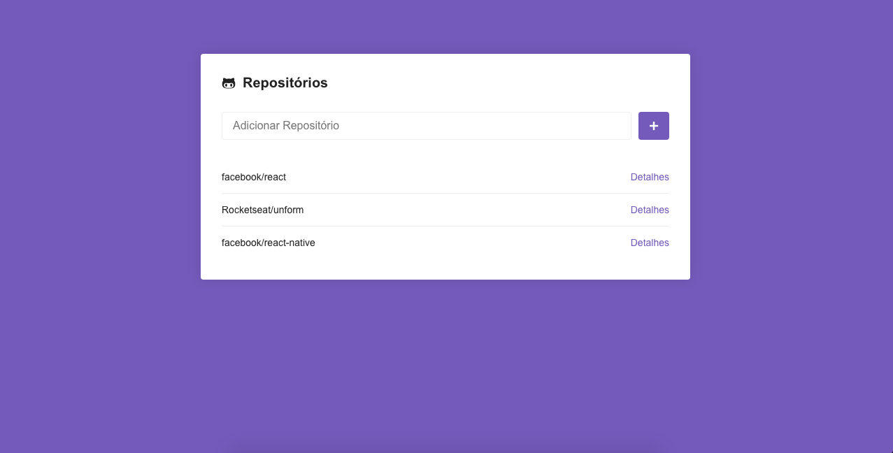
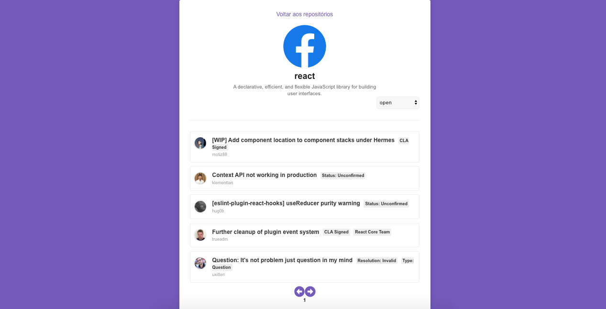

<h1 align="center">
  
</h1>

<h3 align="center">
  Desafio 5: Primeiro projeto com ReactJS
</h3>

## Sobre o desafio 5

Aplicação criada para o [Desafio 05](https://github.com/Rocketseat/bootcamp-gostack-desafio-05#desafio-05-aplica%C3%A7%C3%A3o-com-reactjs) do Bootcamp GoStack da Rocketseat.

A aplicação consiste em adicionar repositórios presentes no github e armazenar as informações no localstorage, para isso, foi utilizado a API do github. Nos detalhes de cada repositório, são exibidas as issues, podendo filtrar a listagem pelas issues abertas, fechadas, ou todas.

### Print da Aplicação

## Licença

Esse projeto está sob a licença MIT. Veja o arquivo [LICENSE](LICENSE) para mais detalhes.
